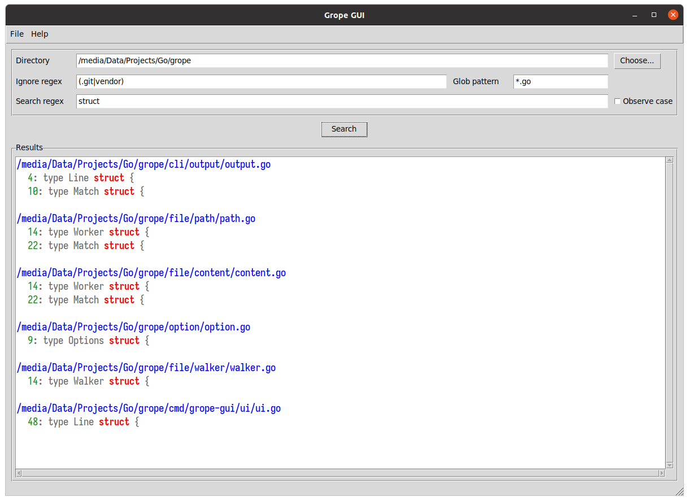

# Grope
**A small command line utility for finding text in many files**

---
## Description

It's basically [grep](https://en.wikipedia.org/wiki/Grep) but faster and uses colors in the output.


## Installation

```
go install ./...
```

## GUI

Grope now features a GUI that will only probably work with Linux running X11.  
This uses my [Goat](https://github.com/nomad-software/goat) GUI toolkit.



## CLI

```
grope -dir="~/Code" -glob="*.go" -regex="^(foo|bar)$" -case -ignore="^(baz|qux)$"
```

## Help

Run the following command for help.

```
grope -help
```
