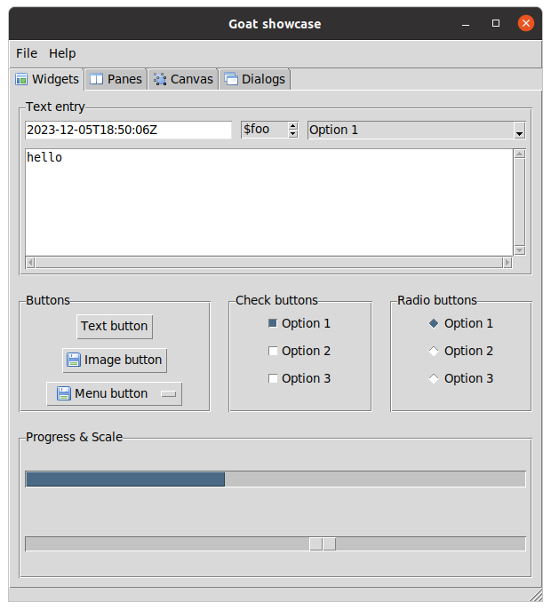
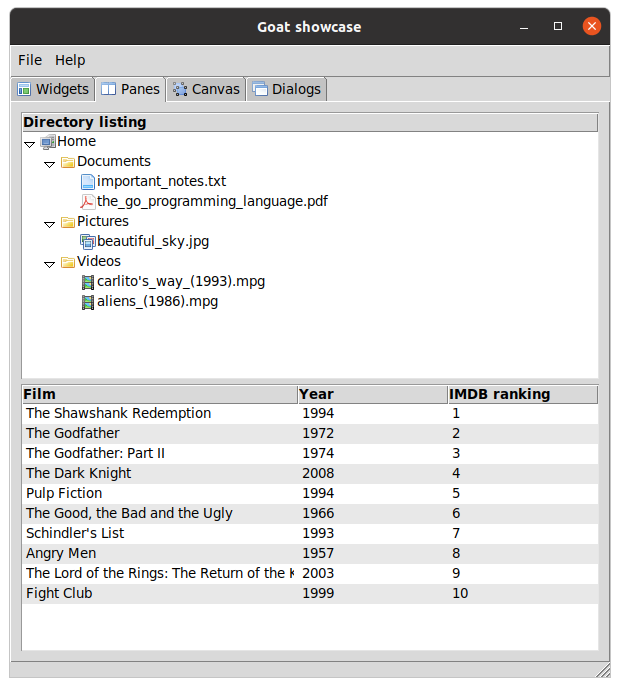
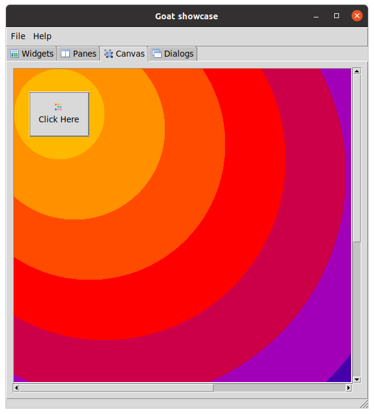
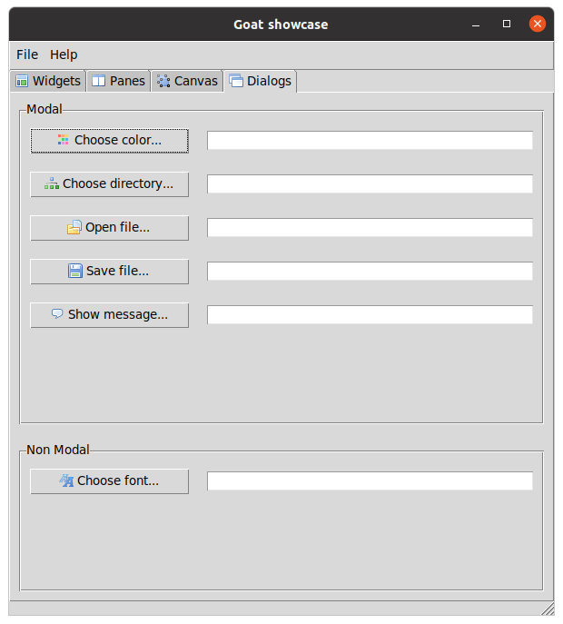

# Goat

GUI toolkit for the Go programming language based on Tcl/Tk.

## Overview

Goat is a fully cross-platform GUI toolkit based on
[Tcl/Tk](https://www.tcl.tk/about/). Goat allows you to build GUI applications easily
and with the knowledge of a consistent, native look and feel on every platform.

## Screenshots






_Compiled on Linux_

## Documentation

https://pkg.go.dev/github.com/nomad-software/goat

## Supported platforms

* Linux
* MacOS

### Windows

It would be quite trivial to support windows but I don't have access to a
Windows machine for development. Pull requests are welcome in this respect.

## Dependencies

### Install Tcl and Tk header files and libraries.

#### Linux

```bash
sudo apt install tcl-dev tk-dev
```

#### MacOS

```bash
brew install --cask xquartz
brew install tcl-tk
```

* https://formulae.brew.sh/cask/xquartz
* https://formulae.brew.sh/formula/tcl-tk

This is completely untested!

#### Windows

These would be provided by DLLs.
See https://github.com/nomad-software/tkd#windows-1

This is completely untested!
